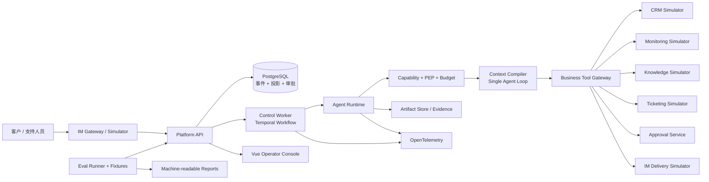
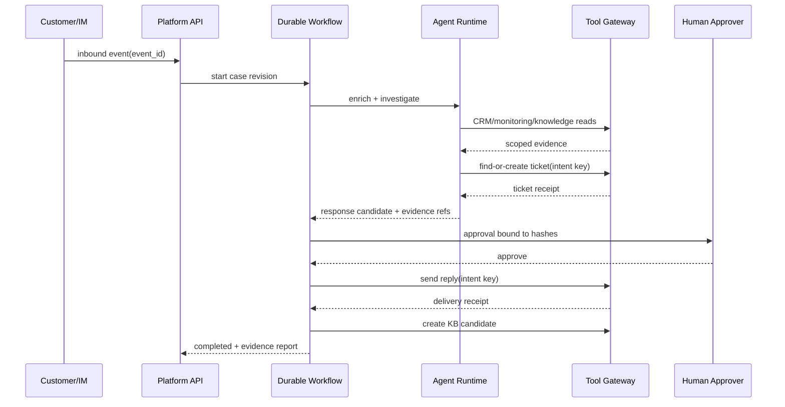

# WeFlow 参考架构

> 本文是 Explore 阶段的参考设计，不表示代码已经实现。每个阶段仍需由对应 OpenSpec change 固化接口和验收。

## 1. 逻辑架构



逻辑分为三面：

- **控制面**：API、Workflow、事件账本、投影和操作控制；
- **执行面**：Agent Runtime、Context、Tool Gateway、Simulator/Adapter；
- **证据面**：Trace、Artifact、PolicyDecision、Approval、Replay 和 Evaluation。

本地开发可由 Docker Compose 部署在一台机器，但代码边界不得合并成无法测试的单体流程。

## 2. 建议单仓库骨架

```text
WeFlow/
├── apps/
│   ├── platform-api/          # FastAPI：Case、控制、查询、审批 API
│   ├── control-worker/        # Temporal Workflow/Activity
│   ├── agent-runtime/         # Context、Agent Adapter、Tool Gateway
│   ├── business-simulator/    # CRM/监控/知识/工单/IM 确定性环境
│   └── web-console/           # Vue：时间线、证据、回放、审批、评测
├── packages/
│   ├── python/
│   │   ├── weflow-contracts/
│   │   ├── weflow-control-kernel/
│   │   ├── weflow-extension-sdk/
│   │   ├── weflow-telemetry/
│   │   └── weflow-testkit/
│   └── typescript/weflow-contracts/
├── contracts/                # 语言无关源 schema
├── evals/
│   ├── tasks/
│   ├── graders/
│   └── suites/
├── tests/
│   ├── contracts/
│   ├── integration/
│   ├── security/
│   ├── recovery/
│   └── e2e/
├── deploy/
│   ├── compose/
│   ├── docker/
│   └── observability/
├── docs/
├── reports/
├── scripts/dev.py
└── openspec/
```

工程基线建议与 ForgeCode 保持一致：Python workspace 使用 uv，前端 workspace 使用 pnpm，所有日常操作通过跨平台 `scripts/dev.py` 汇总。禁止把真实密钥写入 `.env.example`、配置默认值、fixture 或 Trace。

## 3. Case 状态机

```text
RECEIVED
  → NORMALIZING
  → ENRICHING_CONTEXT
  → TRIAGING
  → INVESTIGATING
  → TICKET_READY
  → RESPONSE_READY
  → AWAITING_APPROVAL
  → DELIVERING
  → FOLLOWING_UP
  → RESOLVED
  → KB_CANDIDATE_READY
  → COMPLETED
```

可暂停/异常状态：

- `WAITING_FOR_CUSTOMER`：关键信息缺失；
- `WAITING_FOR_OPERATOR`：需要人工判断；
- `PAUSED`：显式暂停；
- `POLICY_DENIED`：动作被策略拒绝；
- `BUDGET_EXCEEDED`：预算耗尽；
- `NEEDS_RECONCILIATION`：外部副作用结果未知；
- `FAILED`、`CANCELLED`。

状态只能由合法事件推进。任何影响目标、身份、权限、环境或验收规则的修改都创建新 CaseRevision，不能改写运行历史。

## 4. 核心合同

所有合同默认 `extra=forbid`、不可变、版本化，并可生成 JSON Schema/OpenAPI/TypeScript 类型。

### Case 与身份

- `InboundMessageEvent`
- `CaseTask`
- `CaseRevision`
- `TenantIdentity`
- `CustomerIdentity`
- `SlaPolicy`
- `CaseBudget`

### Agent 与工具

- `AgentManifest`
- `ContextManifest`
- `CapabilityGrant`
- `ToolRequest`
- `ToolResult`
- `PolicyDecision`
- `Checkpoint`

### 证据与交付

- `Artifact`
- `EvidenceReport`
- `ResponseCandidate`
- `ApprovalRequest`
- `ApprovalDecision`
- `DeliveryReceipt`
- `KnowledgeCandidate`

### 评测

- `EvaluationTask`
- `EnvironmentSnapshot`
- `Oracle`
- `GraderResult`
- `EvaluationResult`
- `RunMetrics`
- `FailureClassification`

## 5. 事件、投影和血缘

PostgreSQL 保存追加式业务事件，读模型通过投影获得；Temporal 历史不能作为唯一审计事实。核心血缘：

```text
tenant_id → case_id → revision → workflow_id/run_id
→ trace_id/span_id → context_manifest_hash
→ environment_snapshot_hash → tool_request/result
→ policy_decision → response_candidate_hash
→ evidence_report_hash → approval_id → delivery_receipt
→ evaluation_result
```

关键事件示例：

- `inbound.received.v1`、`inbound.deduplicated.v1`
- `case.revision-created.v1`、`case.state-transitioned.v1`
- `agent.step-completed.v1`、`tool.requested.v1`、`tool.completed.v1`
- `policy.decided.v1`、`checkpoint.saved.v1`
- `ticket.intent-recorded.v1`、`ticket.reconciled.v1`
- `approval.requested.v1`、`approval.decided.v1`
- `delivery.completed.v1`、`knowledge.candidate-created.v1`
- `evaluation.completed.v1`

## 6. 一次 Happy Path 时序



## 7. 副作用一致性

每个副作用具有稳定 idempotency key 和 natural key：

| 副作用 | Natural key |
| --- | --- |
| Case 创建 | `tenant:channel:event_id` |
| 工单创建 | `tenant:case:revision` |
| 工单更新 | `ticket_id:expected_version:operation` |
| 审批请求 | `case:revision:candidate_hash:policy_hash` |
| 外发消息 | `conversation:case:response_revision` |
| 知识候选 | `case:resolution_hash` |

恢复算法：已完成直接返回；已存在且身份匹配则补 complete；不存在才执行；冲突或未知进入 reconciliation。外部 API 即使声明幂等，Harness 仍保存本地 intent 和观察结果。

## 8. Agent Loop

M1 Agent Loop 有界执行：

1. Context Compiler 生成不可变 Context Manifest；
2. Provider Adapter 请求下一步结构化行动；
3. Tool Gateway 在调用前执行 capability、policy 和 budget；
4. 工具结果转为 Evidence 引用和最小必要上下文；
5. 检测重复行动、连续错误和无进展；
6. Agent 只能返回 `needs_information`、`needs_operator` 或 `response_candidate`，不能直接完成 Case；
7. Verifier 校验候选后，Workflow 决定下一状态。

Provider 层至少有 Replay Adapter 和一个 OpenAI-compatible live adapter。若接混元，只替换 endpoint、凭据和模型配置，不把供应商细节泄漏到领域合同。

## 9. 模型外 Policy

Policy Engine 默认拒绝，至少检查：

- tenant、case、revision 和 actor 身份；
- 工具/action/resource scope；
- 字段级数据可见性；
- 外发内容的敏感信息；
- Workflow 当前状态；
- wall time、tokens、cost、工具数、失败数；
- 审批角色、有效期和候选哈希；
- 重复副作用和 expected version。

每次决定产生可解释 `PolicyDecision`，包含 policy/capability version、reason code、trace id 和被脱敏的资源摘要。

## 10. Verifier 与完成门禁

`RESPONSE_READY` 前必须通过：

- 必需 CRM/SLA 字段完整；
- 关键诊断断言有有效 Evidence；
- 工单字段、严重度和关联 Case 正确；
- 公开回复不含内部或跨租户信息；
- 工具调用、PolicyDecision、Trace 与 Artifact 血缘完整；
- 预算未超限。

`DELIVERING` 前还必须通过：

- approval 的 revision、candidate、evidence、policy 哈希全部匹配；
- outbound idempotency key 未产生冲突；
- 渠道身份与 conversation scope 正确。

模型或 LLM Judge 不能覆盖失败的硬门禁。

## 11. 可观测与 Replay

OpenTelemetry span 覆盖 Workflow activity、模型调用、工具、Policy、外部副作用、审批等待和 grader。大文本、客户内容和工具结果默认保存 hash、摘要或访问受控的 Artifact reference；脱敏发生在持久化之前。

Operator Console 最小视图：

- Case 状态时间线；
- Context/预算摘要；
- Agent step 与工具调用；
- Policy 拒绝和故障恢复；
- Evidence lineage；
- 候选/审批哈希比对；
- Replay 控件；
- 单任务与 suite 评测报告。

## 12. 本地开发与验证模式

提供两种明确模式：

1. **离线确定性模式**：SQLite/内存投影可选、Replay Adapter、Simulator、固定 fixture，不需要模型密钥和公网；
2. **服务边界模式**：PostgreSQL、Temporal、对象存储、OTel、API、Worker、Runtime 和 Web Console。

统一开发命令建议：

```text
python scripts/dev.py check
python scripts/dev.py demo
python scripts/dev.py baseline
python scripts/dev.py test
python scripts/dev.py lint
python scripts/dev.py typecheck
python scripts/dev.py stack-up
```

任何演示必须明确当前使用 Replay 还是真实模型，并分别报告成本和限制。
